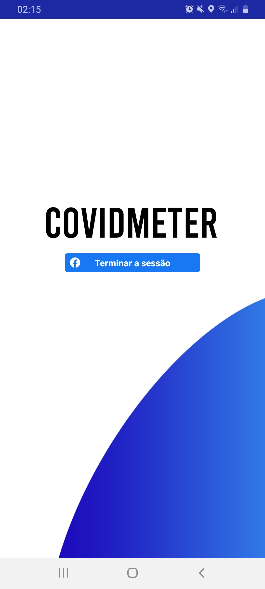
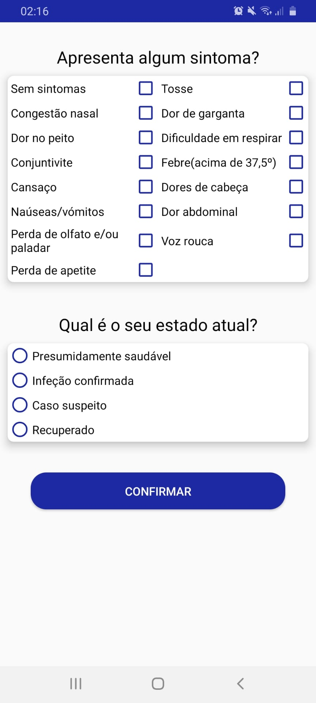
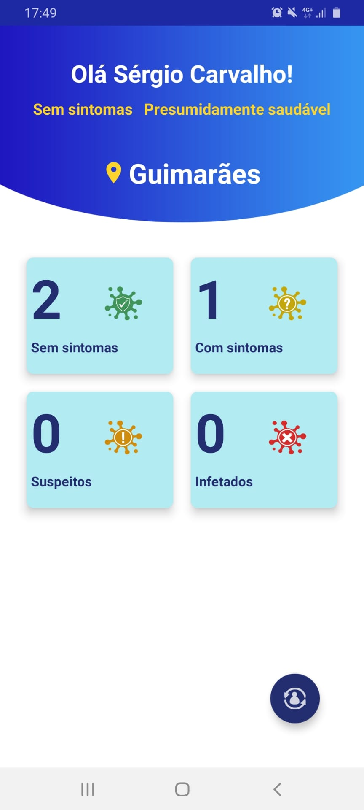

# CovidMeter
## Projeto Final da UC Paradigmas da Programação II

Universidade do Minho

* Nota final: 19 em 20 valores

### Descrição do Projeto

Pretende-se criar um app para dar visão do numero de utilizadores infectados/saudaveis de uma determinada comunidade.
Cada utilizador atualiza o seu estado de saúde e tem acesso a um dashboard que lhe dá a informação dos outros utilizadores num raio de 15km.

### Imagens dos menus

  
   
  

